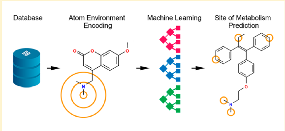

# BayesLabs-Internship
All the work  and Research Papers , I will be reading and trying to implement at my Internship @ Bayes Labs  (OSR Group Owned by Boltzmann Labs) 

1.Research Paper 1: FAME 2: Simple and Effective Machine Learning Model ofCytochrome P450 Regioselectivity

The metabolic system has evolved as a primary line of defenseof organisms against potentially harmful xenobiotics. Bio-transformation can yield metabolites that differ substantiallyfrom their parent compounds with respect to biological andphysicochemical properties.1For example, only about 3% of alldrug metabolites are confirmed to maintain pharmacologicalactivity, and even though the primary function of the metabolicsystem is to detoxify substances, at least 7% of metabolites areknown as toxic or reactive.2Therefore, understandingmetabolism is essential for the development of effective andsafe compounds, in particular drugs, agrochemicals andcosmetics
This paper describes ways to use the current function descriptors to select SOMs .

